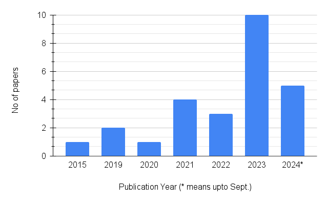

<h2 align="center">Decade of Natural Language Processing in Chronic Pain: A Systematic Review</a></h2>
<h5 align="center">This is part of BMI500 coursework at Emory University</h5>
<h5 align="center">Instructors: Profs. Clifford & Reyna</h5>
<h5 align="center">

  

<b>Figure 1: Number of articles considered in this review.</b>

  
